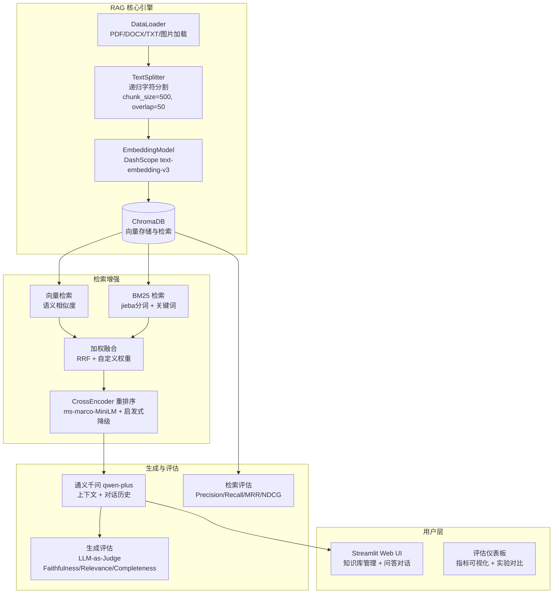

# 📚 Jie_Rag — 智能知识库问答系统

> 基于 RAG（Retrieval-Augmented Generation）架构的企业级知识库问答系统，支持混合检索、重排序、OCR 识别和完整的检索质量评估体系。

[](https://www.python.org/)
[](https://www.langchain.com/)
[](https://streamlit.io/)
[](https://www.docker.com/)
[](LICENSE)

---

## 🏗️ 系统架构



## ✨ 核心特性

### 🔍 混合检索
- **向量语义检索**：基于 DashScope text-embedding-v3，捕获语义相似度
- **BM25 关键词检索**：jieba 中文分词 + rank_bm25 精确匹配
- **加权融合排序**：可配置权重（默认 0.7 向量 + 0.3 BM25），RRF 归一化
- **CrossEncoder 重排序**：优先加载 sentence-transformers 模型，自动降级到启发式算法

### 📄 多格式文档支持
| 格式 | 加载方式 | 特性 |
|------|---------|------|
| PDF | PyPDFLoader | 逐页解析 |
| DOCX | Docx2txtLoader | 保留段落结构 |
| TXT | TextLoader | UTF-8 编码 |
| 图片 (JPG/PNG/BMP/TIFF/WebP) | **qwen-vl-plus OCR** | 多模态视觉识别 |

### 📊 检索质量评估体系
- **检索层指标**：Precision@K, Recall@K, MRR, NDCG@K
- **生成层指标**：Faithfulness（忠实度）, Relevance（相关性）, Completeness（完整性）— LLM-as-Judge
- **实验追踪**：SQLite 存储实验记录，支持 A/B 对比和相对提升计算
- **可视化仪表板**：Streamlit 独立页面，Plotly 交互图表

### 🖥️ Web 交互界面
- 文件上传（支持拖拽）+ 实时处理进度条
- 知识库浏览 / 全文搜索 / 向量 t-SNE 可视化（Plotly 散点图）
- 聊天式问答界面，显示来源引用和置信度
- 对话历史管理（最近 10 轮上下文窗口）
- 文档批量管理与单块删除

### 🐳 工程化
- Docker / Docker Compose 一键部署
- 环境变量配置管理（`.env`）
- 模块化架构：`core` / `evaluation` / `webui` / `config` 清晰分层
- 向量数据库 JSON 导出备份

## 🚀 快速开始

### 前置要求
- Python 3.10+
- 阿里云 [DashScope API Key](https://dashscope.console.aliyun.com/)（免费额度可用）

### 本地运行

```bash
# 1. 克隆仓库
git clone <your-repo-url>
cd Jie_Rag

# 2. 安装依赖
pip install -r documents/requirements.txt

# 3. 配置 API Key
cp .env.example .env
# 编辑 .env 文件，填入你的 DASHSCOPE_API_KEY

# 4. 启动问答系统
streamlit run app/webui/main.py

# 5. （可选）启动评估仪表板
streamlit run app/evaluation/dashboard.py
```

### Docker 部署

```bash
# 配置环境变量
cp .env.example .env
# 编辑 .env 填入 API Key

# 启动服务
docker-compose up -d

# 访问 http://localhost:8501
```

详细部署指南见 [`docs/DEPLOYMENT.md`](documents/DEPLOYMENT.md)

## 📈 评估系统使用

```bash
# 完整评估（检索 + 生成）
python -m app.evaluation.evaluation_runner --mode full --k 5

# 仅检索评估（快速模式）
python -m app.evaluation.evaluation_runner --mode retrieval --k 5

# 启动评估可视化仪表板
streamlit run app/evaluation/dashboard.py
```

### 评估指标体系

| 指标 | 说明 | 范围 |
|------|------|------|
| **Precision@K** | 前 K 个结果中相关文档占比 | 0–1 |
| **Recall@K** | 所有相关文档中被检索到的比例 | 0–1 |
| **MRR** | 第一个相关文档排名的倒数均值 | 0–1 |
| **NDCG@K** | 归一化折扣累积增益 | 0–1 |
| **Faithfulness** | 答案是否忠实于上下文（LLM 判定） | 1–5 |
| **Relevance** | 答案与问题的相关性 | 1–5 |
| **Completeness** | 答案的完整程度 | 1–5 |

## 🧪 运行测试

```bash
# 系统组件验证
python test/test_system.py

# 文档加载 + 分割测试
python test/test_ocr_split.py <文件路径>

# 向量数据库导出测试
python test/test_export_vector_db.py

# 单元测试（pytest）
pytest test/ -v
```

## 📁 项目结构

```
Jie_Rag/
├── app/
│   ├── core/                       # 核心 RAG 引擎
│   │   ├── data_loader.py          # 多格式文档加载器
│   │   ├── text_splitter.py        # 递归字符分割
│   │   ├── embedding.py            # DashScope 嵌入模型封装
│   │   ├── vector_db.py            # ChromaDB 向量数据库
│   │   ├── hybrid_retriever.py     # 混合检索器（向量 + BM25）
│   │   ├── reranker.py             # CrossEncoder 重排序
│   │   ├── rag_chain.py            # RAG 查询编排（检索→重排→生成）
│   │   └── image_ocr.py            # qwen-vl-plus 图片 OCR
│   ├── evaluation/                 # 检索质量评估体系
│   │   ├── retrieval_evaluator.py  # Precision/Recall/MRR/NDCG
│   │   ├── generation_evaluator.py # LLM-as-Judge 生成评估
│   │   ├── dataset_manager.py      # 测试数据集管理
│   │   ├── experiment_tracker.py   # SQLite 实验追踪 (A/B 对比)
│   │   ├── evaluation_runner.py    # 完整评估流程运行器
│   │   └── dashboard.py            # Streamlit 可视化仪表板
│   └── webui/
│       └── main.py                 # 主问答界面
├── config/
│   └── settings.py                 # 统一配置管理
├── test/                           # 测试脚本
├── data/                           # 运行时数据（gitignore）
│   ├── documents/                  # 上传文档存储
│   └── vector_store/               # ChromaDB 持久化
├── documents/                      # 项目文档
├── Dockerfile
├── docker-compose.yml
└── README.md
```

## 🛠️ 技术栈

| 层级 | 技术 | 用途 |
|------|------|------|
| **LLM** | 通义千问 qwen-plus | 答案生成 |
| **Embedding** | DashScope text-embedding-v3 | 文本向量化 |
| **OCR** | DashScope qwen-vl-plus | 图片文字识别 |
| **向量数据库** | ChromaDB | 向量存储与检索 |
| **关键词检索** | rank_bm25 + jieba | BM25 精确匹配 |
| **重排序** | sentence-transformers CrossEncoder | 检索结果精排 |
| **框架** | LangChain 0.2+ | RAG 流水线编排 |
| **前端** | Streamlit + Plotly | Web 界面 + 可视化 |
| **部署** | Docker / Docker Compose | 容器化部署 |
| **评估存储** | SQLite | 实验数据持久化 |

## 🎯 面试展示要点

本项目展示了以下 Agent 开发岗位所需的核心能力：

1. **RAG 架构深度理解**：从文档加载到答案生成的完整链路
2. **检索技术栈**：向量检索 + 关键词检索 + 重排序的混合策略
3. **评估体系设计**：检索指标 + LLM-as-Judge + 实验追踪 + A/B 对比
4. **工程化能力**：模块化架构、Docker 部署、配置管理、环境变量
5. **LLM 应用开发**：Prompt Engineering、对话历史管理、API 集成
6. **可观测性**：t-SNE 向量可视化、评估仪表板、性能指标追踪

---

*Built with LangChain, ChromaDB, Streamlit, and DashScope*
