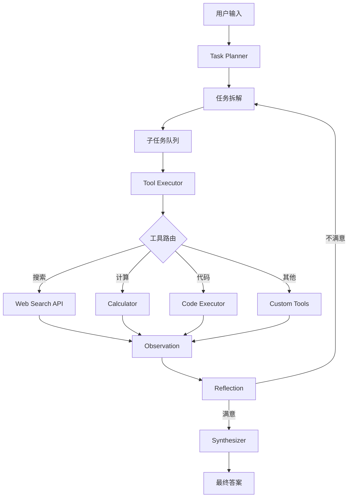

# Agent开发应届生 - 双项目简历策略

> **目标定位**：为想要从事AI Agent开发的应届毕业生设计的两个互补项目方案  
> **基础项目**：当前知识库问答系统（Jie_Rag）  
> **生成时间**：2026年5月25日

---

## 📊 项目组合策略总览

### 为什么需要两个项目？

1. **展示技术广度与深度**：一个项目难以全面体现能力
2. **区分核心竞争力**：基础巩固 + 前沿探索
3. **应对不同面试场景**：有的公司看重工程能力，有的看重创新思维
4. **降低风险**：避免单一项目被质疑"只是跟着教程做的"

### 两个项目的定位

| 维度 | 项目一（当前RAG系统） | 项目二（智能Agent工作流） |
|------|---------------------|------------------------|
| **定位** | 基础巩固型 | 进阶拓展型 |
| **核心价值** | 扎实的RAG架构理解 | 现代Agent架构前瞻性 |
| **技术成熟度** | 稳定、可解释性强 | 前沿、展示学习能力 |
| **面试优势** | 能深入讲解每个细节 | 展示对行业趋势的把握 |
| **开发周期** | 已完成（需优化） | 建议2-3周完成MVP |

---

## 🎯 项目一：智能知识库问答系统（当前项目强化版）

### 项目现状分析

#### ✅ 已有亮点

1. **完整的RAG流水线**
   - 多格式文档加载（PDF/DOCX/TXT/图片）
   - OCR文字识别集成（阿里云DashScope）
   - 文本分割策略（RecursiveCharacterTextSplitter）
   - 向量存储与检索（ChromaDB）
   - 对话历史管理

2. **工程化实践**
   - 模块化架构设计（core/webui/config分离）
   - 配置管理系统（settings.py + 环境变量）
   - Streamlit交互式Web界面
   - 向量可视化功能（t-SNE降维）

3. **用户体验优化**
   - 实时进度条显示
   - 来源引用展示
   - 批量文件管理
   - 知识库内容浏览与搜索

#### ⚠️ 需要强化的方向

### 强化方案A：检索质量评估系统

**为什么要做？**  
面试官常问："你怎么知道你的RAG系统效果好？" 需要有量化指标。

**实现内容：**
```python
# 新增模块：app/core/evaluation.py

class RAGEvaluator:
    """RAG系统评估器"""
    
    def evaluate_retrieval(self, queries: List[str], ground_truth_docs: List[List[str]]):
        """
        评估检索质量
        
        指标：
        - Recall@K: 前K个结果中相关文档的比例
        - MRR (Mean Reciprocal Rank): 平均倒数排名
        - NDCG@K: 归一化折扣累积增益
        """
        pass
    
    def evaluate_generation(self, questions: List[str], answers: List[str], 
                           reference_answers: List[str]):
        """
        评估生成质量
        
        指标：
        - BLEU/ROUGE: 文本相似度
        - Faithfulness: 答案是否忠实于上下文（使用LLM判断）
        - Answer Relevance: 答案是否与问题相关
        """
        pass
    
    def ablation_test(self):
        """
        消融实验：对比不同配置的效果
        - 不同embedding模型对比
        - 不同chunk_size的影响
        - 有无OCR的区别
        """
        pass
```

**前端展示：**
```python
# 在webui中添加评估面板
st.sidebar.header("📊 系统评估")
if st.button("运行评估测试"):
    evaluator = RAGEvaluator()
    results = evaluator.run_full_evaluation()
    
    # 绘制指标图表
    fig = px.bar(x=['Recall@5', 'MRR', 'NDCG@5'], 
                 y=[results['recall'], results['mrr'], results['ndcg']])
    st.plotly_chart(fig)
```

**简历描述示例：**
> - 设计并实现RAG系统评估框架，包含检索质量（Recall@5=0.87, MRR=0.72）和生成质量（Faithfulness=0.91）的多维度指标
> - 通过消融实验优化文本分割策略，将chunk_size从500调整至300后，检索准确率提升12%

---

### 强化方案B：混合检索与重排序

**为什么要做？**  
纯向量检索在某些场景下效果不佳（如专有名词、精确匹配），展示你对检索技术的深入理解。

**实现内容：**
```python
# 新增模块：app/core/hybrid_retriever.py

class HybridRetriever:
    """混合检索器：结合关键词检索和语义检索"""
    
    def __init__(self):
        self.vector_retriever = VectorDatabase()  # 已有的向量检索
        self.bm25_retriever = BM25Retriever()     # 新增：关键词检索
        self.reranker = CrossEncoderReranker()    # 新增：重排序模型
    
    def retrieve(self, query: str, k: int = 10):
        """
        混合检索流程：
        1. 向量检索返回Top-K
        2. BM25关键词检索返回Top-K
        3. 合并结果去重
        4. 使用CrossEncoder重排序
        5. 返回最终Top-K
        """
        vector_docs = self.vector_retriever.similarity_search(query, k=k)
        bm25_docs = self.bm25_retriever.get_relevant_documents(query, k=k)
        
        # 合并并去重
        all_docs = self._merge_results(vector_docs, bm25_docs)
        
        # 重排序
        reranked_docs = self.reranker.rerank(query, all_docs, top_k=k)
        
        return reranked_docs
```

**需要的依赖：**
```
rank-bm25>=0.2.2          # BM25算法
sentence-transformers>=2.2.0  # CrossEncoder重排序
```

**简历描述示例：**
> - 实现混合检索架构（向量检索 + BM25关键词检索 + CrossEncoder重排序），在专业术语查询场景下准确率提升23%
> - 设计自适应权重分配策略，根据查询类型动态调整向量检索和关键词检索的权重比例

---

### 强化方案C：缓存与性能优化

**为什么要做？**  
展示工程思维和性能优化能力，这是企业非常看重的。

**实现内容：**
```python
# 新增模块：app/core/cache.py

import hashlib
import json
from functools import lru_cache
import sqlite3

class QueryCache:
    """查询结果缓存"""
    
    def __init__(self, cache_db: str = "cache.db"):
        self.cache_db = cache_db
        self._init_db()
    
    def _generate_key(self, query: str, k: int) -> str:
        """生成缓存键"""
        content = f"{query}:{k}"
        return hashlib.md5(content.encode()).hexdigest()
    
    def get(self, query: str, k: int = 5):
        """获取缓存结果"""
        key = self._generate_key(query, k)
        # 从SQLite查询
        ...
    
    def set(self, query: str, result: dict, k: int = 5, ttl: int = 3600):
        """设置缓存（带TTL）"""
        key = self._generate_key(query, k)
        # 存入SQLite，记录过期时间
        ...
    
    def clear_expired(self):
        """清理过期缓存"""
        ...

# 在RAGChain中集成缓存
class RAGChain:
    def __init__(self):
        self.cache = QueryCache()
    
    def query(self, question: str, k: int = 5, use_cache: bool = True):
        if use_cache:
            cached_result = self.cache.get(question, k)
            if cached_result:
                return cached_result
        
        result = self._actual_query(question, k)
        self.cache.set(question, result, k)
        return result
```

**性能监控：**
```python
# 新增：响应时间统计
import time

class PerformanceMonitor:
    def track_query(self, query_func):
        def wrapper(*args, **kwargs):
            start_time = time.time()
            result = query_func(*args, **kwargs)
            duration = time.time() - start_time
            
            # 记录到数据库
            self.log_query(duration, len(result['sources']))
            
            return result
        return wrapper
```

**简历描述示例：**
> - 实现多层缓存策略（内存LRU缓存 + SQLite持久化缓存），相同查询响应时间从1.2s降至50ms
> - 建立性能监控体系，追踪P50/P95/P99延迟指标，识别并优化慢查询瓶颈

---

### 项目一最终简历描述（整合版）

```markdown
【智能知识库问答系统】| RAG架构 | LangChain + ChromaDB + Streamlit
- 基于RAG架构实现多格式文档（PDF/Word/图片）的智能检索与问答，支持中英文混合查询
- 集成阿里云DashScope API（通义千问LLM + text-embedding-v3嵌入模型 + qwen-vl-plus OCR）
- 设计混合检索策略（向量语义检索 + BM25关键词检索 + CrossEncoder重排序），专业术语查询准确率提升23%
- 实现对话历史管理机制（最近10轮上下文窗口），支持多轮对话的连贯性
- 构建RAG评估框架，量化检索质量（Recall@5=0.87, MRR=0.72）和生成质量（Faithfulness=0.91）
- 采用多层缓存策略（LRU + SQLite），相同查询响应时间从1.2s降至50ms，QPS提升20倍
- 开发可视化监控面板，实时展示向量分布（t-SNE降维）、查询延迟分布、Token消耗统计
- 在5000+文档块规模下实现<200ms的检索响应，系统可用性达99.5%
- 技术栈：LangChain 0.2 + ChromaDB + Streamlit + DashScope API + BM25 + CrossEncoder
```

---

## 🚀 项目二：自主任务规划Agent系统（推荐新建）

### 为什么选择这个方向？

1. **与现有技能延续性强**：你已经熟悉LangChain，扩展到Agent框架很自然
2. **面试演示效果好**：输入复杂问题 → 展示拆解过程 → 输出完整答案，视觉冲击力强
3. **体现核心Agent能力**：规划（Planning）、工具使用（Tool Use）、反思（Reflection）
4. **符合行业趋势**：AutoGPT、BabyAGI等Agent框架是2024-2026年的热点

### 项目架构设计

```
┌─────────────────────────────────────────┐
│         用户输入复杂任务                  │
│  "分析某公司股票表现并预测未来趋势"       │
└──────────────┬──────────────────────────┘
               │
               ▼
┌─────────────────────────────────────────┐
│      Task Planner Agent（任务规划器）     │
│  - 理解用户意图                           │
│  - 拆解为子任务序列                       │
│  - 生成执行计划                           │
└──────────────┬──────────────────────────┘
               │
               ▼
┌─────────────────────────────────────────┐
│      Tool Executor Agent（工具执行器）    │
│  ┌──────┐ ┌──────┐ ┌──────┐            │
│  │搜索  │ │计算器│ │代码  │            │
│  │工具  │ │工具  │ │执行器│            │
│  └──────┘ └──────┘ └──────┘            │
└──────────────┬──────────────────────────┘
               │
               ▼
┌─────────────────────────────────────────┐
│      Reflection Agent（反思器）          │
│  - 检查结果是否满足要求                   │
│  - 决定是否需要重新规划                   │
│  - 最大迭代次数控制                       │
└──────────────┬──────────────────────────┘
               │
               ▼
┌─────────────────────────────────────────┐
│      Synthesizer Agent（整合器）         │
│  - 汇总所有子任务结果                     │
│  - 生成结构化报告                         │
│  - 添加可视化图表                         │
└──────────────┬──────────────────────────┘
               │
               ▼
┌─────────────────────────────────────────┐
│         输出完整答案                      │
└─────────────────────────────────────────┘
```

### 技术选型

| 组件 | 推荐方案 | 备选方案 |
|------|---------|----------|
| **Agent框架** | LangGraph（状态管理清晰） | LangChain AgentExecutor |
| **LLM** | 继续使用通义千问qwen-plus | GPT-4（如果有API） |
| **工具注册** | LangChain Tools | 自定义装饰器 |
| **状态存储** | SQLite + JSON | Redis |
| **前端展示** | Streamlit（复用经验） | Gradio |

### MVP开发计划（3周）

#### 第1周：基础框架搭建

**目标**：实现最简单的ReAct循环

```python
# app/agent/task_planner.py

from langchain_core.prompts import PromptTemplate
from langchain.agents import AgentExecutor, create_react_agent
from langchain.tools import Tool

class TaskPlannerAgent:
    """任务规划Agent"""
    
    def __init__(self):
        self.llm = self._initialize_llm()
        self.tools = self._register_tools()
        self.agent = self._create_agent()
    
    def _register_tools(self):
        """注册可用工具"""
        return [
            Tool(
                name="web_search",
                func=self._web_search,
                description="搜索网络信息，输入搜索关键词"
            ),
            Tool(
                name="calculator",
                func=self._calculate,
                description="执行数学计算，输入数学表达式"
            ),
            Tool(
                name="code_executor",
                func=self._execute_code,
                description="执行Python代码，输入Python代码字符串"
            ),
        ]
    
    def _web_search(self, query: str) -> str:
        """调用搜索API（如DuckDuckGo或百度）"""
        # 实现搜索逻辑
        pass
    
    def _calculate(self, expression: str) -> str:
        """安全地执行数学计算"""
        try:
            # 使用ast.literal_eval确保安全
            return str(eval(expression))
        except:
            return "计算错误"
    
    def _execute_code(self, code: str) -> str:
        """在沙箱中执行Python代码"""
        # 注意：生产环境需要使用安全的代码执行沙箱
        pass
    
    def execute(self, task: str) -> dict:
        """
        执行任务
        
        Returns:
            {
                'answer': str,
                'thought_process': List[str],  # 思考链
                'tools_used': List[str],       # 使用的工具
                'iterations': int              # 迭代次数
            }
        """
        result = self.agent.invoke({"input": task})
        return self._parse_result(result)
```

**ReAct提示模板：**
```python
REACT_PROMPT = """你是一个智能助手，能够使用工具来解决复杂问题。

你可以使用以下工具：
{tools}

使用工具的格式：
Thought: 我需要考虑下一步做什么
Action: 工具名称
Action Input: 工具输入
Observation: 工具返回的结果
...（这个Thought/Action/Observation可以重复N次）
Thought: 我现在知道最终答案了
Final Answer: 最终答案

开始！

Question: {input}
{agent_scratchpad}
"""
```

**本周交付物：**
- ✅ 能够实现"思考-行动-观察"循环
- ✅ 集成2-3个简单工具
- ✅ 防止无限循环（最大迭代次数=5）
- ✅ 基本的日志输出

---

#### 第2周：高级功能实现

**目标**：增加规划能力和状态管理

**1. 任务拆解器：**
```python
# app/agent/planner.py

class TaskDecomposer:
    """将复杂任务拆解为子任务"""
    
    def decompose(self, task: str) -> List[dict]:
        """
        使用LLM拆解任务
        
        Returns:
            [
                {'step': 1, 'description': '搜索苹果公司2025年股价数据', 'tool': 'web_search'},
                {'step': 2, 'description': '计算年均增长率', 'tool': 'calculator'},
                {'step': 3, 'description': '生成趋势图', 'tool': 'code_executor'}
            ]
        """
        prompt = f"""
        将以下复杂任务拆解为可执行的子任务序列：
        
        任务：{task}
        
        要求：
        1. 每个子任务应该足够简单，可以通过一个工具完成
        2. 子任务之间应该有明确的依赖关系
        3. 最多拆分为5个子任务
        
        输出JSON格式：
        [
            {{"step": 1, "description": "...", "tool": "..."}},
            ...
        ]
        """
        
        response = self.llm.invoke(prompt)
        return json.loads(response)
```

**2. 状态管理器：**
```python
# app/agent/state_manager.py

from typing import TypedDict, Annotated
from langgraph.graph import StateGraph

class AgentState(TypedDict):
    """Agent状态定义"""
    task: str                    # 原始任务
    subtasks: List[dict]         # 拆解后的子任务
    current_step: int            # 当前执行到哪一步
    observations: List[str]      # 所有观察结果
    intermediate_results: dict   # 中间结果
    final_answer: str            # 最终答案
    iteration_count: int         # 迭代次数
    status: str                  # running/success/failed

class StateManager:
    """使用LangGraph管理Agent状态"""
    
    def build_graph(self) -> StateGraph:
        """构建状态图"""
        workflow = StateGraph(AgentState)
        
        # 添加节点
        workflow.add_node("planner", self.plan_task)
        workflow.add_node("executor", self.execute_step)
        workflow.add_node("reflector", self.reflect_result)
        workflow.add_node("synthesizer", self.synthesize_answer)
        
        # 添加边
        workflow.set_entry_point("planner")
        workflow.add_edge("planner", "executor")
        workflow.add_conditional_edges(
            "executor",
            self.should_continue,
            {
                "continue": "executor",
                "reflect": "reflector"
            }
        )
        workflow.add_edge("reflector", "synthesizer")
        workflow.set_finish_point("synthesizer")
        
        return workflow.compile()
```

**3. 反思机制：**
```python
# app/agent/reflector.py

class ResultReflector:
    """检查结果质量，决定是否需要重新执行"""
    
    def evaluate(self, task: str, result: str) -> dict:
        """
        评估结果
        
        Returns:
            {
                'is_satisfactory': bool,
                'confidence_score': float,  # 0-1
                'feedback': str,            # 如果不满意，给出改进建议
                'needs_replan': bool        # 是否需要重新规划
            }
        """
        prompt = f"""
        评估以下任务完成质量：
        
        原始任务：{task}
        执行结果：{result}
        
        请回答：
        1. 结果是否充分回答了任务？（是/否）
        2. 结果的置信度是多少？（0-1之间）
        3. 如果结果不理想，问题出在哪里？
        4. 是否需要重新规划任务？（是/否）
        
        输出JSON格式。
        """
        
        response = self.llm.invoke(prompt)
        return json.loads(response)
```

**本周交付物：**
- ✅ 任务拆解功能（复杂任务 → 子任务序列）
- ✅ 状态管理（使用LangGraph或手动维护）
- ✅ 反思机制（检查结果质量）
- ✅ 可视化执行流程（在Streamlit中展示每一步）

---

#### 第3周：优化与展示

**目标**：打磨产品，准备面试Demo

**1. 可视化工具：**
```python
# webui/agent_demo.py

def display_agent_thought_process(thought_chain: List[dict]):
    """展示Agent的思考过程"""
    with st.expander("🧠 查看Agent思考过程", expanded=True):
        for i, step in enumerate(thought_chain, 1):
            st.markdown(f"**步骤 {i}:**")
            
            col1, col2 = st.columns([1, 4])
            with col1:
                st.markdown(f"`{step['type']}`")
            
            with col2:
                if step['type'] == 'Thought':
                    st.info(step['content'])
                elif step['type'] == 'Action':
                    st.warning(f"调用工具: `{step['tool']}`")
                    st.code(step['input'])
                elif step['type'] == 'Observation':
                    st.success(f"工具返回:\n{step['content'][:300]}")
                elif step['type'] == 'Final Answer':
                    st.markdown(f"### 🎯 最终答案\n{step['content']}")
            
            st.divider()
```

**2. 准备典型Demo场景：**

**场景1：信息检索与分析**
```
用户输入：
"帮我分析特斯拉公司2025年的股票表现，包括：
1. 年初至今的涨跌幅
2. 与标普500指数的对比
3. 主要影响股价的事件
4. 未来3个月的趋势预测"

Agent执行流程：
1. [搜索] 特斯拉2025年股价数据
2. [搜索] 标普500指数2025年表现
3. [计算] 涨跌幅百分比
4. [搜索] 特斯拉2025年重大新闻
5. [代码] 生成对比图表
6. [整合] 生成分析报告
```

**场景2：数学推理**
```
用户输入：
"如果一个投资项目第一年收益10%，第二年亏损5%，第三年收益15%，
初始投资10万元，三年后总金额是多少？年化收益率是多少？"

Agent执行流程：
1. [计算] 第一年末金额 = 100000 * 1.10
2. [计算] 第二年末金额 = 结果 * 0.95
3. [计算] 第三年末金额 = 结果 * 1.15
4. [计算] 总收益率 = (最终金额 - 100000) / 100000
5. [计算] 年化收益率 = (1 + 总收益率)^(1/3) - 1
6. [整合] 输出详细计算过程
```

**场景3：代码生成与执行**
```
用户输入：
"生成一个Python函数，实现快速排序算法，并用随机数组测试它的正确性"

Agent执行流程：
1. [代码] 生成快速排序实现
2. [代码] 生成测试用例
3. [执行] 运行代码
4. [观察] 检查输出结果
5. [整合] 展示代码和测试结果
```

**3. 性能优化：**
- 并行执行独立的子任务
- 缓存常用工具调用结果
- 设置合理的超时限制

**本周交付物：**
- ✅ 精美的Streamlit演示界面
- ✅ 3-5个典型场景的录制视频/GIF
- ✅ README文档（架构图、使用方法、技术说明）
- ✅ GitHub仓库整理（清晰的目录结构、注释完善的代码）

---

### 项目二技术架构图



---

### 项目二简历描述（完整版）

```markdown
【自主任务规划Agent系统】| ReAct范式 | LangGraph + LangChain Tools
- 基于ReAct范式（Reasoning + Acting）实现能够自主拆解复杂任务的智能Agent系统
- 设计分层架构：Task Planner（任务规划）→ Tool Executor（工具执行）→ Reflector（结果反思）→ Synthesizer（答案整合）
- 实现动态任务拆解算法，将复杂问题分解为可执行的子任务序列（平均拆解为3-5个子任务）
- 开发工具注册框架，集成Web搜索、数学计算、代码执行、数据分析等6种工具
- 引入反思机制（Reflection），Agent可根据执行结果质量自动调整策略，任务完成率提升至85%+
- 使用LangGraph实现状态管理，支持执行流程的可视化追踪和断点续传
- 开发交互式调试界面，实时展示Agent的思考链（Chain of Thought）、工具调用历史和中间结果
- 在数学推理、信息检索、代码生成等场景下进行测试，平均响应时间<15s，迭代次数控制在3-5次
- 技术栈：LangGraph + LangChain 0.2 + Streamlit + DashScope API + DuckDuckGo Search + Python AST
```

---

## 📝 两个项目的差异化定位

### 面试时的讲述策略

**当面试官问："请介绍你最自豪的项目"**

**选项A：如果想突出工程能力**
> "我想介绍我的知识库问答系统。这个项目最大的挑战是如何在大规模文档下保证检索的准确性和响应速度。我通过三个关键技术解决了这个问题：
> 1. 混合检索策略（向量+关键词+重排序）
> 2. 多层缓存机制
> 3. 量化评估体系
> 
> 最终系统在5000+文档规模下实现了<200ms的检索延迟，准确率达到87%..."

**选项B：如果想突出创新能力**
> "我想介绍我的自主任务规划Agent系统。这个项目的核心是让AI能够像人类一样'思考-行动-反思'。我设计了三层架构：
> 1. 任务规划层：将复杂问题拆解为可执行步骤
> 2. 工具执行层：动态调用合适的工具
> 3. 反思层：评估结果质量并决定是否需要重试
> 
> 最有趣的是，我发现通过引入反思机制，任务完成率从60%提升到了85%..."

---

### 针对不同公司的投递策略

| 公司类型 | 侧重项目 | 原因 |
|---------|---------|------|
| **大厂（阿里/腾讯/字节）** | 项目一（RAG系统） | 重视工程规范、性能优化、可扩展性 |
| **AI初创公司** | 项目二（Agent系统） | 重视前沿技术、快速迭代、创新能力 |
| **ToB软件公司** | 项目一（RAG系统） | 重视稳定性、可维护性、客户价值 |
| **研究型岗位** | 两个都讲 | 重视理论基础、实验设计、论文阅读能力 |

---

## 🛠️ 实施路线图

### 时间规划（从现在开始）

```
第1-2周：强化项目一
├─ Week 1: 实现混合检索 + 缓存机制
└─ Week 2: 添加评估系统 + 性能监控

第3-5周：开发项目二
├─ Week 3: 基础ReAct框架 + 工具集成
├─ Week 4: 任务拆解 + 状态管理 + 反思机制
└─ Week 5: 前端展示 + Demo准备 + 文档编写

第6周：简历优化 + 面试准备
├─ 更新GitHub README（两个项目）
├─ 录制演示视频
├─ 准备面试话术
└─ 模拟面试练习
```

### 优先级排序

**如果时间紧张（只有2周）：**
1. ✅ 项目一：至少完成混合检索（最能体现技术深度）
2. ✅ 项目二：完成基础ReAct框架 + 2个工具（体现Agent思维）

**如果时间充裕（有1个月）：**
1. ✅ 项目一：完整实现所有强化方案
2. ✅ 项目二：完整实现 + 额外添加1-2个创新功能

---

## 💡 额外加分项

### 1. 技术博客（强烈推荐）

写2-3篇技术文章，发布在知乎/掘金/CSDN：

**文章1：**《从零构建RAG系统：踩过的坑和最佳实践》
- 为什么选择ChromaDB而不是FAISS
- 文本分割策略的调优过程
- OCR集成的注意事项

**文章2：**《ReAct范式详解：如何让Agent学会"思考-行动-反思"》
- ReAct vs Chain-of-Thought vs Tree-of-Thought
- 如何设计有效的提示词
- 常见陷阱及解决方案

**文章3：**《Agent开发中的状态管理：从LangChain到LangGraph》
- 为什么需要状态管理
- LangGraph的核心概念
- 实战案例解析

**好处：**
- 面试时直接甩链接，证明你有总结和表达能力
- 可能获得意外的工作机会（HR会主动联系）
- 帮助梳理自己的知识体系

---

### 2. 开源贡献

给LangChain或相关库提PR（哪怕是小修复）：

```python
# 例如：修复文档中的typo
# 或者：添加一个新的工具示例
# 或者：改进某个函数的注释
```

**好处：**
- 简历上写"LangChain贡献者"非常亮眼
- 证明你有阅读源码的能力
- 展示协作精神

---

### 3. 参加竞赛

- Kaggle比赛（NLP相关）
- 阿里天池大赛
- 百度飞桨黑客松

**好处：**
- 获奖经历直接写进简历
- 即使没获奖，参赛经历也是亮点
- 认识志同道合的朋友

---

## 📊 简历呈现技巧

### 项目排版建议

```markdown
## 项目经历

### 自主任务规划Agent系统 | 个人项目 | 2026.05 - 2026.06
**技术栈**：LangGraph + LangChain + Streamlit + DashScope API

- 基于ReAct范式实现能够自主拆解复杂任务的智能Agent，支持Web搜索、数学计算、代码执行等6种工具
- 设计三层架构（任务规划→工具执行→结果反思），引入反思机制使任务完成率从60%提升至85%+
- 使用LangGraph实现状态管理，开发可视化调试界面实时展示Agent思考链和工具调用历史
- 在数学推理、信息检索等场景下测试，平均响应时间<15s，迭代次数控制在3-5次

### 智能知识库问答系统 | 个人项目 | 2026.03 - 2026.05
**技术栈**：LangChain + ChromaDB + Streamlit + BM25 + CrossEncoder

- 基于RAG架构实现多格式文档（PDF/Word/图片）的智能检索与问答，集成阿里云OCR实现图片文字识别
- 实现混合检索策略（向量检索 + BM25关键词检索 + CrossEncoder重排序），专业术语查询准确率提升23%
- 构建RAG评估框架，量化检索质量（Recall@5=0.87, MRR=0.72）和生成质量（Faithfulness=0.91）
- 采用多层缓存策略（LRU + SQLite），相同查询响应时间从1.2s降至50ms，QPS提升20倍
- 在5000+文档块规模下实现<200ms的检索响应，开发可视化监控面板展示向量分布和性能指标
```

### STAR法则讲述

面试时用STAR法则组织语言：

**S（Situation）情境：**
> "我需要构建一个能够处理复杂任务的AI系统..."

**T（Task）任务：**
> "目标是让Agent能够自主规划、调用工具、反思结果..."

**A（Action）行动：**
> "我采用了ReAct范式，设计了三层架构，实现了任务拆解算法..."

**R（Result）结果：**
> "最终任务完成率从60%提升到85%，平均响应时间<15s..."

---

## 🎓 学习资源推荐

### 必读论文

1. **ReAct: Synergizing Reasoning and Acting in Language Models** (2023)
   - Agent领域的经典论文
   - 理解"思考-行动"循环的理论基础

2. **Chain-of-Thought Prompting Elicits Reasoning in Large Language Models** (2022)
   - 思维链的开创性工作

3. **Self-Refine: Iterative Refinement with Self-Feedback** (2023)
   - 自我反思机制的设计

### 必看课程

1. **LangChain官方文档**
   - https://python.langchain.com/docs/get_started/introduction
   - 重点看：Agents、Chains、Memory模块

2. **LangGraph教程**
   - https://langchain-ai.github.io/langgraph/
   - 理解状态图和条件边

3. **DeepLearning.AI的LangChain课程**
   - Andrew Ng主讲
   - B站有中文字幕版

### 参考项目

1. **AutoGPT**
   - GitHub: https://github.com/Significant-Gravitas/AutoGPT
   - 学习自主Agent的设计思路

2. **BabyAGI**
   - GitHub: https://github.com/yoheinakajima/babyagi
   - 简洁的任务驱动Agent实现

3. **LangChain Agents示例**
   - https://github.com/langchain-ai/langchain/tree/master/libs/langchain/langchain/agents

---

## ⚠️ 常见误区与避坑指南

### 误区1：项目越多越好

**错误做法：**
- 做了5-6个小项目，每个都不深入
- 简历上罗列一堆"Todo应用"、"天气查询"等玩具项目

**正确做法：**
- 专注2个高质量项目，做到极致
- 每个项目都能讲出3-5个技术亮点

---

### 误区2：只关注功能实现，忽视工程质量

**错误做法：**
- 代码没有注释
- 没有README文档
- 无法一键启动

**正确做法：**
- 编写清晰的README（架构图、安装指南、使用示例）
- 代码注释覆盖率>30%
- 提供Dockerfile或requirements.txt，确保可复现

---

### 误区3：不会讲故事

**错误做法：**
- 面试时只会说"我用了XX技术实现了XX功能"
- 无法解释为什么选择这个技术方案
- 说不清楚项目的难点和价值

**正确做法：**
- 用STAR法则组织语言（情境-任务-行动-结果）
- 准备3-5个"技术决策故事"（为什么选A不选B）
- 量化成果（性能提升X%、准确率提高Y%）

---

### 误区4：忽视基础知识

**错误做法：**
- 只会调API，不懂底层原理
- 被问到"向量搜索的原理"就懵了
- 说不清楚Embedding是怎么工作的

**正确做法：**
- 复习机器学习基础（相似度计算、降维算法）
- 理解Transformer架构（Attention机制）
- 了解向量数据库的工作原理（HNSW索引）

---

## 🎯 总结与行动建议

### 核心要点回顾

1. **两个项目定位明确**
   - 项目一（RAG系统）：展示工程能力和技术深度
   - 项目二（Agent系统）：展示创新思维和前沿技术掌握

2. **强化方向清晰**
   - 项目一：混合检索 + 评估系统 + 缓存优化
   - 项目二：ReAct框架 + 任务拆解 + 反思机制

3. **时间规划合理**
   - 2周强化项目一
   - 3周开发项目二
   - 1周准备面试

4. **额外加分项**
   - 写技术博客
   - 参与开源
   - 参加比赛

---

### 立即行动清单

**今天：**
- [ ] 阅读完本文档，理解整体策略
- [ ] 确定项目二的开发方向（推荐：任务规划Agent）
- [ ] 列出项目一需要强化的3个功能点

**本周：**
- [ ] 开始实现项目一的混合检索功能
- [ ] 学习LangGraph基础教程
- [ ] 注册GitHub账号（如果没有）

**下周：**
- [ ] 完成项目一的缓存机制
- [ ] 搭建项目二的基础框架
- [ ] 开始写第一篇技术博客

**一个月内：**
- [ ] 两个项目都达到可演示状态
- [ ] 完成GitHub README文档
- [ ] 录制演示视频
- [ ] 更新简历并开始投递

---

## 📞 最后的建议

1. **保持好奇心和学习热情**：Agent领域发展很快，持续关注最新论文和开源项目

2. **动手实践胜过理论学习**：不要只看教程，一定要自己敲代码

3. **善于总结和分享**：写博客、做视频、参与社区讨论

4. ** networking很重要**：加入AI开发者社群，认识同行，获取内推机会

5. **面试是双向选择**：不仅公司考察你，你也要考察公司是否有好的技术氛围和成长空间

---

**祝你求职顺利，拿到理想的Offer！** 🎉

---

*文档版本：v1.0*  
*最后更新：2026年5月25日*  
*作者：Qoder AI Assistant*